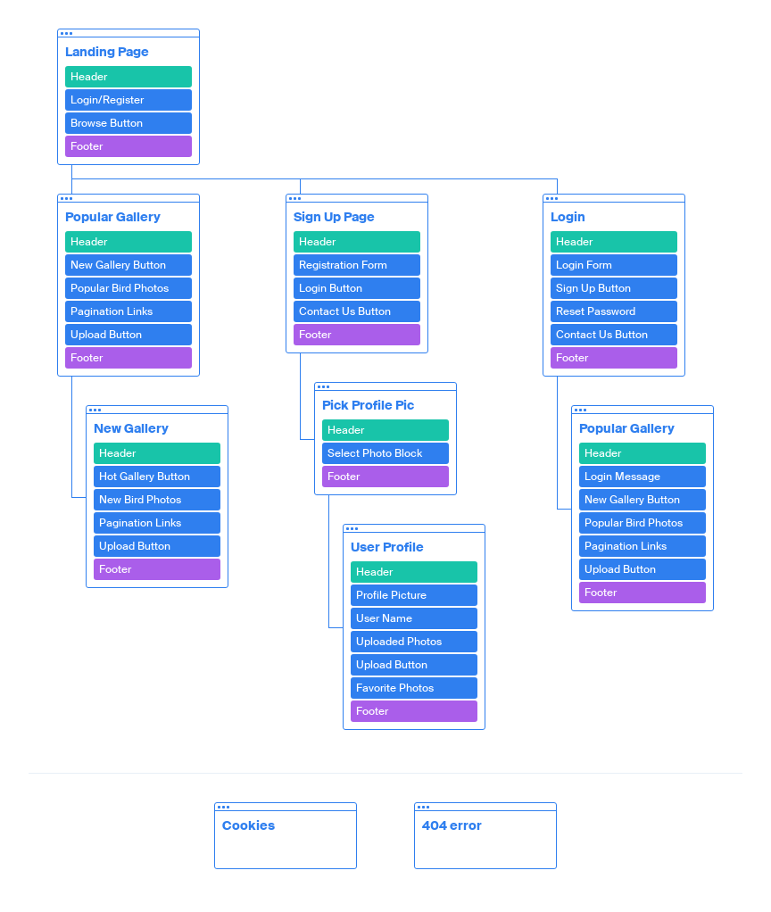

# Bird Friend


## Project Outline

- [Bird Friend](#) is a photo sharing web application. Users can create, search, and edit photo profiles for birds they've spotted, and comment or like photo profiles from other users.
- All users, even those non-registered, can browse through uploaded photos of birds and read other people's comments to get a sense of the community.
- After browsing, users who want to get more involved by commenting or uploading their own photos will receive prompts to register to gain this functionality.
- This creates a deeper link between the user and the application, allowing the site developer to build a sense of community.
- This app features a landing page, photo galleries, user registration and login forms, comment and like features, and the user ability to edit or delete their bird photo profiles and user profiles.
- The technologies used to build this app include HTML, [Tailwind CSS](https://tailwindcss.com/docs), JavaScript, Python, [Flask](https://palletsprojects.com/p/flask/), and [MongoDB Atlas](https://www.mongodb.com/cloud/atlas)

## Project Goals

- To buid a fun community around casual bird spotting in cities and the countryside, as many people don't really take the time to stop and really see birds in the same way as other wildlife ; dogs, cats, foxes, deer.
- To drive camera sales on behalf of a 3rd party through native advertisement, as a way of making the site and community more sustainable for the site developer.

## Live project

**[View the live project here](#)**

## Table of Contents

  * [User experience](#user-experience)
    + [User Stories](#user-stories)
    + [Wireframes](#wireframes)
  * [Database Models and Schema](#database-models-and-schema)
    + [Database Models](#database-models)
    + [Database Schema](#database-schema)
    + [MongoDb](#mongodb)
  * [Design](#design)
    + [Colour Scheme](#colour-scheme)
    + [Typography](#typography)
  * [Features](#features)
    + [Main](#main)
      - [Landing page](#landing-page)
      - [Gallery page.](#gallery-page)
      - [Navigation](#navigation)
      - [Contact page.](#contact-page)
    + [User Pages](#user-pages)
      - [Register / Login](#register---login)
      - [Password Change Request](#password-change-request)
      - [Profile](#profile)
    + [Dog Pages](#dog-pages)
      - [Dog Profile Page](#dog-profile-page)
      - [Comments](#comments)
    + [Admin](#admin)
    + [Custom Error Pages](#custom-error-pages)
    + [Features left to Implement.](#features-left-to-implement)
  * [Technologies used.](#technologies-used)
    + [Flask](#flask)
      - [Flask extensions used](#flask-extensions-used)
    + [TailwindCSS](#tailwindcss)
    + [Cloudinary](#cloudinary)
      - [Cloudinary Upload API](#cloudinary-upload-api)
      - [Cloudinary Transformation URL API](#cloudinary-transformation-url-api)
    + [Other Tools, Libraries & Programs](#other-tools--libraries---programs)
  * [Testing](#testing)
  * [Deployment](#deployment)
    + [Requirements To Deploy:](#requirements-to-deploy-)
    + [Cloning This Project:](#cloning-this-project-)
      - [To Work With Your Local Clone:](#to-work-with-your-local-clone-)
    + [Deploying To Heroku](#deploying-to-heroku)
      - [Create a procfile:](#create-a-procfile-)
      - [For Deployment:](#for-deployment-)
  * [Credits](#credits)
    + [Code](#code)
    + [Content](#content)

<small><a href='http://ecotrust-canada.github.io/markdown-toc/'>Table of contents generated with markdown-toc</a></small>

## User Experience

#### User Goals

The first-time user is looking for:
- A web app that brings them closer to everyday, almost invisible, birds.
- A fun, relaxed community that's more relaxed and fun than many birding sites.

The returning user is looking for:
- A community, with whom they can enjoy their new-found interest.
- A user-profile that makes them feel seen, and where they can revisit favorite photos.

The frequent user is looking for:
- A way to measure the popularity of their own photo uploads.
- A way of taking sharper, higher quality photos to raise that popularity, once measurable.

#### Site Developer Goals
The Developer is looking to:
- Create an inviting, community-drive application to share their passion for birds.
- Develop a small income from advertising 3rd party cameras so the site can pay for itself.

### User Stories

- New Visitor

  - I want to a colourful, vibrant landing page that grabs me.
  - I'd like to see all the site content, and some of the features, before registration.
  - I'll only register if it's the only way to comment, like and upload photos.
  - I'd like to eventually add my photos to the site, but doing so must be simple.

- Repeat users

  - I'd like a nice profile page, easy login, and a quick fix if I forget my password.
  - I'd like my favorite photos logged to my profile.
  - I'd like to be able to comment on other people's uploads.
  - I want to be able to edit/delete my uploads, and comments.

- Frequent users

- I want to be able to see how many people have liked any of my photos.
- I'd like to see what camera is responsible for the highest quality images.
- I want uploads ranked in terms of popularity, as I grow more invested.
- I want to be able to delete my account if ever I feel frustrated, or finished with it.

-  All Users

   - I'd like to feedback on all my actions on this site.
   - I'd like to be able to contact the admin for any complaints/inappropriate content.
   - I'd prefer endless scrolling as a feature over pagination

- Site Developer

  - I want people to care more about birds, which seem invisible or meaningless to many others.
  - I want the site to pay for itself through 3rd party camera sales, to be sustainable.
  - I want the ability as admin to delete/edit any content that is inappropriate.

### Development Planes

In order to design and create a photo sharing app that would answer these user stories, the project was iterated through the **Five Development Planes**:

<strong>1. <u>Strategy</u></strong>

Broken into three categories, the app will focus on the following target audiences:

- **Roles:**
     - Bird enthusiasts of all levels
     - New Users (Non-Registered)
     - Return Users (Registered)

- **Persona:**
     - New interest in birds
     - Like taking photos casually
     - Enjoy typical social features when sharing photos, e.g. likes & comments

- **Psychographics:**
     - Personality & Attitudes:
          - Open-minded
          - Creative
     - Values:
          - Green / Environmentalist
          - Community
     - Lifestyles:
          - Casual photographer
          - Interested in world around them

The website needs to enable the **user** to:

- Register/login to an account

- Search Bird database by:
    - Bird Type
    - Camera Type
    - Bird Nickname (frequent users)

- View Photo Gallery with the following information:

    - Bird Type
    - Camera Type
    - Bird Nickname
    - Uploader Name
    - Likes

- Upload and edit their own Birds

- Like and view their favourite Birds from other users

- Get in contact with site owner

The website needs to enable the **site developer** to:
- Provide a community-driven photo-sharing app around birds
- Drive 3rd party camera sales from users
- Edit/delete inappropriate content

With these goals in mind, a strategy table was created to determine the trade-off between importance and viability with the following results:

**Strategy Table for Bird Friend:**


<strong>2. <u>Scope</u></strong>

A scope was defined in order to clearly identify what needed to be done in order to align features with the strategy previously defined. This was broken into two categories:
- **Content Requirements**
     - The user will be looking for:
     - Fun, colorful landing page.
     - Easy navigation.
     - Searchable photo Gallery with following info:
        - Bird Type
        - Camera Type
        - Bird Nickname
        - Uploader Name
        - Liked By
     - Simple registration process
     - Customisable User Profile
        - Custom User Name/Password
        - Upload their own photos
        - Save favourite photos
     - Site Developer contact form

- **Functionality Requirements**
     - The user will be able to:
        - Register/Login to account
        - Customise their profile
            - Custom Username/Password
            - Upload their own photos
            - Save favourite photos
        - Navigate to the Photo Gallery:
            - Search by Bird Type, Camera Type or Name (for frequent visitors)
            - My Photos Page
            - My Favourites Page
        - Create Photo Uploads:
            - Bird Type
            - Camera Type
            - Bird Nickname
            - Uploader Name
        - Interact with other users
            - Like other users photos
            - Comment on other users photos
        - Get in contact with the Developer

<strong>3. <u>Structure</u></strong>

The information architecture was organized in order to ensure that users could navigate through the site with ease and efficiency, with the following results: 

**Information Architecture for Bird Friend:**


<strong>4. <u>Skeleton</u></strong>

Wireframe mockups were created in a [Figma Workspace](https://www.figma.com/file/OYjqFGfKfMTxEQ64mMQm2T/Bird-Friend?node-id=59%3A0 "Bird Friend Figma Workspace").

- Home Page:

     


## Design

<strong>5. <u>Surface</u></strong>


- <strong>Colour Scheme</strong>

     - The soft, pastel colour scheme was picked to offset the most commonly occuring, vibrant background colors in casual photographs of birds.

    


- <strong>Typography</strong>

     - The primary font chosen and used on the photo gallery, and bird / user profiles is [Lato](https://fonts.google.com/specimen/Lato "Link to Lato Google Fonts page"). Lato means summer in Polish, and the font reflects its namesake with warmth in its rounded design.

        

     - The Secondary fonts are [Jaldi](https://fonts.google.com/specimen/Jaldi "Link to Jaldi Google Fonts page") and [Roboto Slab](https://fonts.google.com/specimen/Roboto+Slab "Link to Roboto Slab Google Fonts page"). 
     
     - Jaldi is used on the site landing page, and for site headings. It pairs really well with Lato, because it is similarly rounded and warm.

        
    
    - Roboto Slab is used on site links, and for site buttons. Its bolded, thick look is perfect for call-to-action elements like links and buttons, but its curves match it well with Lato and Jaldi.

        

- <strong>Imagery</strong>

     - The imagery used was saved from the Facebook Group [Garden Birds of Ireland](https://www.facebook.com/groups/158412932544035), which is in the public domain. However, because no written permission was obtained, this imagery is used purely within the educational confines of a Code Institue Milestone Project.

[Back to top ⇧](#table-of-contents)

### Wireframes

- [Mobile Wireframes](#)
- [Tablet Wireframes](#)
- [Desktop Wireframes](#)

## Database Models and Schema

### Database Models
- The database consists of four collections - User, Bird, Type, Comment
- User
	- This contains user's username, email address, hashed password string and avatar selection
	- The user ID acts as a reference field in various other collections
- Bird
	- This is where users enter; Bird Type, Camera Type, Location spotted and give a Name (optional).
	- User Id is not entered but is automatically set to the user that uploads the Bird object
	- liked_by is a one to many field automatically referencing IDs of Users that have liked a Bird object
	- img_url is the users uploaded image of the bird
		- img_url_card is the above image with transformations setting height to 350px, width to 525px, low quality on the image and automatically focusing on key part of image using cloudinary API
		- img_card_thumb is also optimized to lower quality and limited to a width of 500px (height remains at auto) 
	- upload_date is an automatically added datetime item
- Bird Type
	- This acts as a reference field for the Bird collection and contains a lists of types that users can choose from when uploading their Bird
- Camera Type
	- This acts as a reference field for the Camera collection and contains a lists of types that users can choose from when uploading their Bird
- Comment
	- author references the User.id that created the comment
	- bird references the Bird.id of the bird to which the comment is attached
	- content is text input of comment
    - datetime is another automatically added datetime item

### Database Schema


### MongoDb

- mongodb was used as the project database.

- I followed the following steps to set it up.
	- signed up to Mongodb and created a shared cluster
	- selected default AWS cloud provider
	- selected Ireland region
	- selected m0 cluster tier
	- chose name for cluster
	- once cluster was created I clicked 'CONNECT' button
	- Selected 'connect your application'
	- selected Python / 3.6 or later as my driver
	- copied the connection string for use in my application
	- set password / cluster name / collection name as enviuronmental variables to connect to my DB within flask
	- used Flask-MongoEngine to interact with my DB within the app

## Features

### Main

#### Landing page

- If the user isn't signed in, then they are greeted with a fun, friendly landing page.
- There are clear links to the Photo Gallery and to Login or Register.
- If the user is already signed in, the landing page redirects to the Popular Photo Gallery.
- The footer is viewable on scroll, but initially hidden off screen to focus the user on the main landing page design and image 
	
#### Gallery page.
-  The default gallery page is the Popular Photo Gallery
-  Option to view newly uploaded birds
-  Clear distinction between 'Popular' and 'New' depending on which page the user is on
-  The sub title navigation link is highlighted yellow for the page that the user is on.
-  Each bird photo card on the gallery page contains links to:
	- Like the bird
	- See the main photo page of the bird with larger picture, more info and comments.
	- Link to the person who uploaded the bird's photo (if user is not also the uploader)
	- Links to delete or edit the bird, if user is the uploader 

- There is a button at the bottom of the gallery to upload a new bird photo 

#### Navigation

- There are two different navigations, depending on whether you are on mobile or tablet+
- On mobile there is a bottom navigation bar, making it easy to access the main links with your thumb (visible once the user has signed in)
- The top mobile navigation simply consists of a 'My Profile' button (or Login/Register buttons if a user has not yet signed in)

- On desktop, the links that are present in the mobile bottom navigation are instead added alongside the 'My Profile' button in the top navigation bar


#### Contact page.

- If user is not logged in:
	- Form has fillable Name/Email/Message fields
- If user is logged in
	- Form has read-only, pre-filled username/email fields for current user
	- Has fillable message form
- All messages sent from contact form send messages to site developer's email    

### User Pages

#### Register / Login Forms

- Both the Register and Login pages have a simple, clean form asking for username / password
- Register form asks for email and password confirmation
- Both pages link to each other if user is already registered / not registered yet
- Both pages link to contact page
- Login page links to a password reset page, if user has forgotten their login password

#### Password Change Request

- Request page features a single email field for users to request a password reset link
- Feedback is given to check your email regardless of whether it is a registered email or not for security reasons (not identifying whether an email is registered or not)
- If it is a registered email, a link with a JWT token is sent to the user's email
- This link leads to a Password Change form with two password fields to type and confirm the users new password

#### Profile

- Displays user's chosen profile picture
- Displays any bird photos user has uploaded
- Displays any birds this user has liked / favorited
- If user views their own profile, they see links to:
	- Change their profile picture
		- Here you can choose to upload an image file from your computer
	- Edit your account
		- Here you can change your username or email 
	- Delete your account 
		- Presents a screen to confirm your password in order to delete your account, along with any of your uploaded birds/comments

### Bird Pages

#### Bird Profile Page

- Displays a larger thumbnail photo of the bird, without cropping to card aspect ratio
	- This image features a link to see original, user upload full-size image
- Displays photo info: Bird Type, Camera Type, Bird Nickname, Uploader, Liked By and the Photo Backstory.
- If current user is photo's owner, then displays buttons to edit or delete photo of bird
	- Edit Bird Photo will load a form with any information pre-filled
	- Uploading a new photo will replace the previous Photo in Bird Friend's cloudinary database
	- Delete photo will ask user's to confirm before deletion

- Otherwise displays text prompting current user to leave a comment   

#### Comments

- Displays avatar of comment author and name, both of which act as a link to their user page
- Displays comment content and date comment was added
- If current user is author, it displays edit and delete comment buttons
	- Edit comment will navigate to a text entry, pre-filled witih the comment user is editing
	- Delete comment will display the comment text as a blockquote and ask user to confirm delete

### Admin

- There is an admin user account which has permissions to delete or edit any user, photo or comment on the site
- A preview of the admin account on the gallery home page will show edit/delete options for all uploaded photos of birds, which are normally hidden unless the uploader is the current user:

- Links for deleting/editing comments and users are also shown in this way for admins.

### Custom Error Pages

- I have created an error pages using the flask app_error handlers
- Each page contains a reason for the error and a navigation link to return to the previous page, along with a humourous image of a sad bulldog in a dress. Errors are:
	- 404 - not found an error
	- 403 - no permission error
	- 500 - server error.

### Features left to Implement.

## Technologies used.

### Flask

- The application was built on the Flask framework. 
- I followed [Corey Schafer's guide on YouTube](https://www.youtube.com/watch?v=Wfx4YBzg16s) in using Flask Blueprints to split my application up itno the following modules:
	- main
	- users
	- birds
	- errors
- This makes it easier to find routes and elements if they need to be updated or changed.
- The templates folder is also split into a similar structure.
	- base.html 
	- /main
	- /user
	- /bird
	- /email
	- /errors
- App configuration settings are contained within ``` config.py ```
- Inside the  ```__init__.py ``` file I've created the app as a [Flask application factory](https://flask.palletsprojects.com/en/1.1.x/patterns/appfactories/).
- Then in the ``` app.py ``` file, the application factory is imported and the function is the invoked ie. ``` app = create_app() ``` which creates the application.

#### Flask extensions used

- [Flask](https://flask.palletsprojects.com/en/1.1.x/)
	- Flask micro framework was used to build the web app using python code.

- [Flask-login](https://flask-login.readthedocs.io/en/latest/)
	- Flask login was used to manage logged in users.

- [Werkzeug](https://werkzeug.palletsprojects.com/en/1.0.x/utils/#module-werkzeug.security)
	- Werkzeug Security Helpers were used to hash the user passwords before storing in the database

- [Flask-Mail](https://flask-login.readthedocs.io/en/latest/)
	- For sending emails relating to the contact and password reset forms
		- For the Heroku deployment, I used the Heroku Sendgrid extension instead, as Flask-Mail was giving me the error `SMTP AUTH extension not supported by server`, although it worked locally.

- [Flask-Mongoengine](http://docs.mongoengine.org/projects/flask-mongoengine/en/latest/)
	- For interacting with the MongoDB database

- [Flask-Wtf](https://flask-wtf.readthedocs.io/en/stable/)
	- For creating forms and adding validation

- [Gunicorn](https://gunicorn.org/)
	- To help deploy the app to Heroku

### TailwindCSS

- [TailwindCSS](https://tailwindcss.com/docs) was used extensively as the primary method of styling the application
- I installed Tailwind by initialising an NPM package within my static folder with `npm init`
- I then ran the following NPM installs within the terminal: `npm install -D tailwindcss@latest postcss@latest autoprefixer@latest postcss-cli` to install the necessary dependencies
- I ran `npx tailwindcss init -p` to create both my tailwind and postcss config files 
- I created two .css files - app.css & compiled.css
- Within app.css I placed the tailwind directives to inject Tailwind's styles into the CSS file:
```
@tailwind base;
@tailwind components;
@tailwind utilities;
```
- I then included a PostCSS command wihtin my package.json to compile the Tailwind libraries into a usable CSS file: `"build:css": "postcss css/app.css -o css/output.css"`
	- Any time that I made custom CSS changes or additions within my app.css or tailwind.config.js files, I would run this command to recompile my CSS file and then complete a hard refresh within my browser to update the changes
- Before deploying the site to Heroku, I ensured that `purge` was set to `true` within my tailwind.config.js file. This ensures that only the necessary classes are compiled in the final CSS file used by my web page, minimising the amount of CSS that the browser has to load as much as possible.

### Cloudinary

#### Cloudinary Upload API

- In adding user images to the website, I utilised the [Cloudinary Upload API](https://cloudinary.com/documentation/image_upload_api_reference)
- Within my Cloudinary account, I set up a hot_dogz folder.
- Within my Bird model I added a method to save uploaded user images into this folder under the format `hot_dogz/{user}/{pk}`
	- All of of a user's bird photos would be saved within one folder, named after the user's username
	- Each bird's photo would be named after it's primary key
- If a user deletes a bird photo or deletes their profile, then the bird photo is deleted from the cloudinary database using the built-in `uploader.destroy()` method. 

#### Cloudinary Transformation URL API

- Within each Bird collection, I added two additional image URLs which utlised the Cloudinary transformation API. These make on-the-fly changes in how the image is rendered on the web page.
	- One URL for displaying image thumbnails on the bird's profile page
	- One URL for displaying at a fixed aspect ratio within the bird card component
- For the `img_url_thumb` i added the transformations: `w_500,c_scale,q_auto:low`
	- Width: 500px
	- Crop: scale
	- Auto render in low quality for smaller file size  
	- These transformations dramatically reduce file size. Here is an example file size difference between clicking on the original full-size image vs what is rendered on a dog's profile page (from 2.95MB to 21.85kb)
		- [Before transformations](docs/screenshots/trans_before.png)
		- [After transformations](docs/screenshots/trans_after.png)

- For the `img_url_card` I wanted images to be a fixed size of 350px x 525px, so I used the transformations `c_fill,g_auto,h_350,w_525,q_auto:low`
	- Crop is set to fill
	- `g_auto` = Gravity set to 'auto'. The 'gravity' transformation determines which part of an image to focus on and decides where a crop should be made
	- Setting it to 'auto' leaves Cloudinary's AI decide where to crop the image, which generally focuses on a dog's face. An example can be seen here:

**Without gravity**:

**With gravity set to 'auto'**: 


### Other Tools, Libraries & Programs

- [Font Awesome](https://fontawesome.com) - For icons used throughout the site
- [GIMP - GNU Image Manipulation Program](https://www.gimp.org) - For image editing
- [favicon.io](https://favicon.io) - For creating favicon .ico
- [Google Fonts](https://fonts.google.com) - for importing chosen fonts
- [Balsamiq](https://balsamiq.com) - For creating my wireframes
- [QuickDBD](https://app.quickdatabasediagrams.com) - For creating my DB schema diagram
- [Am I Responsive?](http://ami.responsivedesign.is) - For creating the mockup image at start of README
- [VSCode](https://code.visualstudio.com) - My primary code editor of choice for the project
- [PyCharm](https://www.jetbrains.com/pycharm/) - Secondary code editor, used particularly for additional PEP 8 compliance functionality

## Testing

**[Please see TESTING.md](TESTING.md)**

To further develop this project, a clone can be made using the following steps:
### 1. Database Creation
The application is connected to a [MongoDB Atlas](https://mongodb.com/ "Link to MongoDB Homeapage") Cluster. A Project database can be created using the following steps:

1. Log into [MongoDB](https://account.mongodb.com/account/login "Link to MongoDB login page") or [create an account](https://account.mongodb.com/account/register "Link to MongoDB sign-up page").
2. Locate and select the `New Project` button on the right side of the page, and give your project a name. Navigate to the project page.
3. Locate and select the `Create a New Cluster` button on the right side of the page. Once selected:
     - Choose **Shared Cluster** which is a free option.
     - Select your **Cloud Provider** and **Region** (in this instance: **AWS** and **Ireland**).
     - Click on **Cluster Tier** and select tier of preference (in this instance: **Basic M0 tier**).
     - Click on **Cluster Name** and create your cluster name.
4. Locate and select `Database Access` on the left side of the page. Once selected, click `Add New Database User`:
     - Choose `Password` for the **Authentication Method**
     - Enter a username and password of your choosing
     - Ensure `Read and write to any database` is selected in **Database User Privileges**
     - Add User
5. Locate and select `Network Access` under `Database Access` on the left side of the page. Once selected, click `Add IP Address`:
     - Select `Allow Access from anywhere` (This is not recommended for full-production applications).
     - Select `Confirm`.
6. Locate and select `Clusters` on the left side of the page (must be provisioned first).
7. Click `Collections`, then `+ Create Database` to start adding documents to your database collections:
     - Enter chosen `Database Name`
     - Enter chosen `Collection Name`
     - Select `Create`
8. Click `Create Collection` and create the necessary collections. See [Information Architecture](#Information-Architecture) for reference of the collections created for this project.

### 2. Local Copy Creation
A Local Clone of the repository can be made in two ways:

- **Forking the Repository:**

     By forking the GitHub Repository we make a copy of the original repository on our GitHub account to view and/or make changes without affecting the original repository by using the following steps:

     1. Log into [GitHub](https://github.com/login "Link to GitHub login page") or [create an account](https://github.com/join "Link to GitHub create account page").
     2. Locate the [GitHub Repository](https://github.com/DaithiShan/bird-friend "Link to GitHub Repo").
     3. At the top of the repository, on the right side of the page, select "Fork".
     4. You should now have a copy of the original repository in your GitHub account.

-  **Creating a Clone**

     How to run this project locally:
     1. Install the [GitPod Browser](https://www.gitpod.io/docs/browser-extension/ "Link to Gitpod Browser extension download") Extension for Chrome.
     2. After installation, restart the browser.
     3. Log into [GitHub](https://github.com/login "Link to GitHub login page") or [create an account](https://github.com/join "Link to GitHub create account page").
     2. Locate the [GitHub Repository](https://github.com/DaithiShan/bird-friend "Link to GitHub Repo").
     5. Click the green "GitPod" button in the top right corner of the repository.
     This will trigger a new gitPod workspace to be created from the code in github where you can work locally.

     How to run this project within a local IDE, such as VSCode:

     1. Log into [GitHub](https://github.com/login "Link to GitHub login page") or [create an account](https://github.com/join "Link to GitHub create account page").
     2. Locate the [GitHub Repository](https://github.com/DaithiShan/bird-friend "Link to GitHub Repo").
     3. Under the repository name, click "Clone or download".
     4. In the Clone with HTTPs section, copy the clone URL for the repository.
     5. In your local IDE open the terminal.
     6. Change the current working directory to the location where you want the cloned directory to be made.
     7. Type 'git clone', and then paste the URL you copied in Step 3.
     ```
     git clone https://github.com/USERNAME/REPOSITORY
     ```
     8. Press Enter. Your local clone will be created.

     (Further reading and troubleshooting on cloning a repository from GitHub [here](https://docs.github.com/en/free-pro-team@latest/github/creating-cloning-and-archiving-repositories/cloning-a-repository "Link to GitHub troubleshooting"))

Once a local clone is created, the environment variables have to be set:

1. Create a `.gitignore` file in the project's root directory.
2. In the terminal window, type `touch env.py` to create the file that will contain the environment variables. 
3. Add `env.py` to the `.gitignore` file.
4. Within the `env.py` file, enter the project's environment variables:
```
import os

os.environ.setdefault("IP", "0.0.0.0")
os.environ.setdefault("PORT", "5000")
os.environ.setdefault("SECRET_KEY", <your_secret_key>)
os.environ.setdefault("MONGO_URI", "mongodb+srv://<username>:<password>@<cluster_name>-ocous.mongodb.net/<database_name>?retryWrites=true&w=majority" )
os.environ.setdefault("MONGO_DBNAME", <your_mongo_db_name>)
```
For the `MONGO_URI` ensure to replace `<username>`, `<password>`, `<cluster_name>` and `<database_name>` with the appropriate alternatives.

### 3. Heroku App Creation
The website requires back-end technology, including a server, application and database. It is because of this that the project was deployed on **Heroku**, a container-based cloud Platform as a Service. There are two ways to deploy on Heroku:

- Using the Heroku Command Line Interface
- Connect to GitHub Repository (the developer recommends this method)

Before deployment can be carried out on Heroku, the following steps must be carried out:

1. Create a `requirements.txt` file to install all requirements. In the terminal window, type the following command:
```
pip3 install -r requirements.txt
```
2. Create a `Procfile` file so that Heroku knows which file runs the app. In the terminal window, type the following command:
```
echo web: python app.py > Procfile
```
*Remove the blank line that may occur at the end of the Procfile to avoid any issues*

3. Push the two files to the repository:
```
git add requirements.txt
git commit -m "Add requirements.txt"

git add Procfile 
git commit -m "Add Procfile"

git push
```
Once these steps are completed, continue with the process:

1. Log into [Heroku](https://id.heroku.com/login "Link to Heroku login page") or [create an account](https://signup.heroku.com/login "Link to Heroku sign-up page").
2. Select the `New` button on the top-right of the page, and choose `Create New App`. Give your app a unique name and set the region (in this instance: **Europe**). Then click `Create App`.
3. Navigate to the `Deploy` tab on the dashboard and select `Connect to GitHub`.
4. Search for the repository name (ensuring it is spelled correctly). Once located, click `Connect`. 
5. Navigate to the `Setting` tab on the dashboard and select `Reveal Config Vars`, entering the necessary key/values as below:

| Key | Value |
 --- | ---
IP | 0.0.0.0
PORT | 5000
SECRET_KEY | `<your_secret_key>`
MONGO_URI | `mongodb+srv://<username>:<password>@<cluster_name>-ocous.mongodb.net/<database_name>?retryWrites=true&w=majority`
MONGO_DBNAME | `<your_mongo_db_name>`

6. Navigate back to the `Deploy` tab and scroll down to `Automatic Deploys`.
7. Ensure that the `master` branch is selected, then select `Enable Automatic Deploys`.

Heroku will receive the pushed code from the GitHub repository and host the application with the required packages set out. 

The deployed version can now be viewed by selecting `View App` in the top-right of the page.

[Back to top ⇧](#table-of-contents)

***


## Credits

### Mentor
- I would like to thank my mentor Seun for always pushing me to deliver the best work I can to every project.

### Code
- HUGE CREDIT TO CJCON90 FOR PROJECT IDEA AND DESIGN INSPIRED COMPLETELY BY IT
- HUGE CREDIT TO REBECCATRACEYT FOR README.MD DESIGN, INSPIRED COMPLETELY BY IT
- My navbar designed was inspired by [this post on TailwindComponents by sebageounity](https://tailwindcomponents.com/component/bottom-and-header-nav-responsive)
- Form design was inspired by [this post on TailwindComponents by darkcris1](https://tailwindcomponents.com/component/facebook-login-page)
- Most of my Flask code and knowledge was inspired by Miguel Grinberg's [Flask Mega-Tutorial](https://blog.miguelgrinberg.com/post/the-flask-mega-tutorial-part-i-hello-world)
- Flask knowledge was also supplemented by Corey Schafer's [Python Flask Tutorial on YouTube](https://www.youtube.com/watch?v=MwZwr5Tvyxo&list=PL-osiE80TeTs4UjLw5MM6OjgkjFeUxCYH), particularly the [use of Blueprints](https://www.youtube.com/watch?v=Wfx4YBzg16s&list=PL-osiE80TeTs4UjLw5MM6OjgkjFeUxCYH&index=11)

### Content
