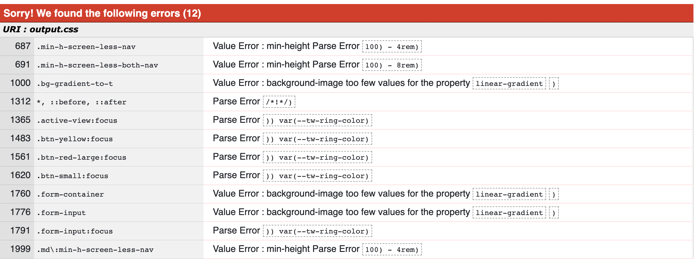
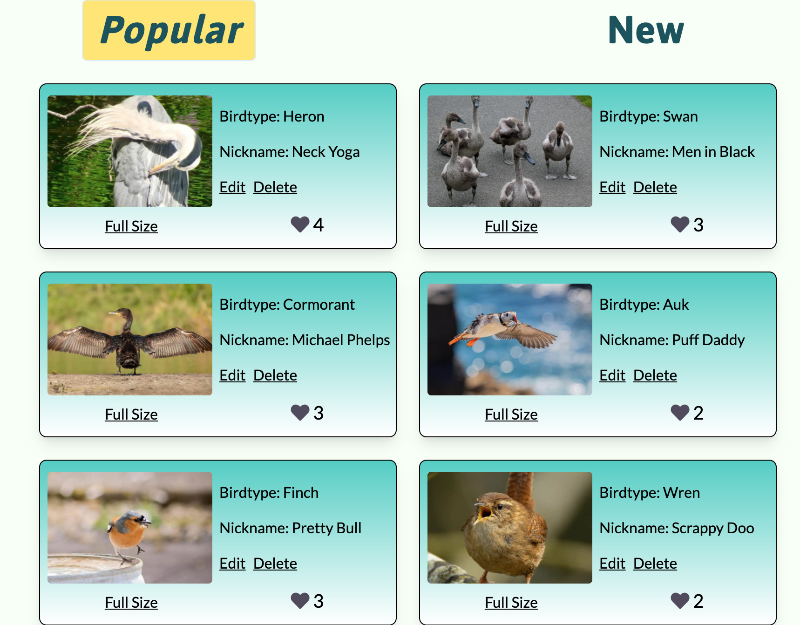
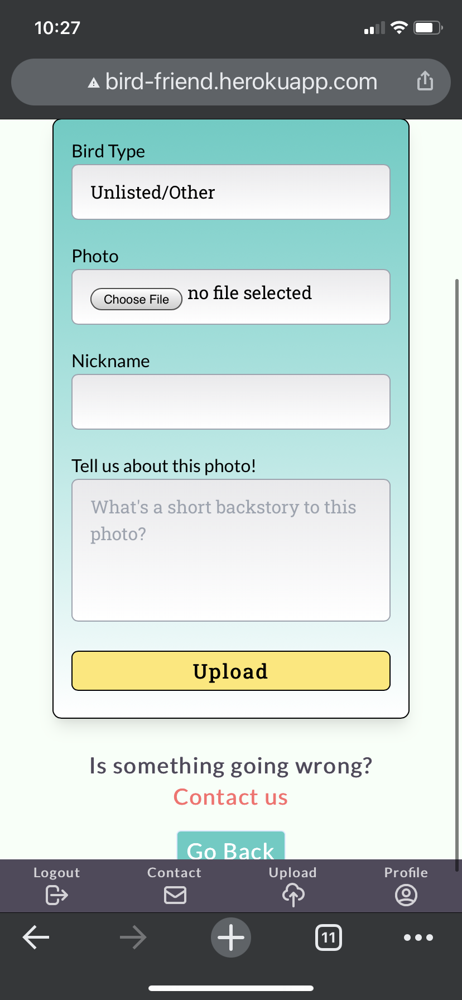

# Testing

## Table of Contents

  * [Functionality](#functionality)
    + [Navigation](#navigation)
      - [Navigation Bar](#navigation-bar)
    + [Main](#main)
      - [Landing Page](#landing-page)
      - [Gallery](#gallery)
      - [Contact](#contact)
    + [User Pages](#user-pages)
      - [Login / Register](#login---register)
      - [Avatar Selection](#avatar-selection)
      - [Reset Password](#reset-password)
      - [User Profile](#user-profile)
    + [Bird Photo Pages](#bird-pages)
      - [Bird Photo Page](#bird-page)
    + [Error](#error)
  * [Performance](#performance)
  * [Validators](#validators)
    + [HTML](#html)
    + [CSS](#css)
    + [JavaScript](#javascript)
  * [PEP8](#pep8)
  * [Compatibility](#compatibility)
    + [Hardware](#hardware)
    + [Browsers](#browsers)
  * [User Stories](#user-stories)
    + [New Visitor](#new-visitor)
    + [Repeat users](#repeat-users)
    + [Frequent users.](#frequent-users)
    + [Website owner](#website-owner)
  * [Known Bugs](#known-bugs)

<small><a href='http://ecotrust-canada.github.io/markdown-toc/'>Table of contents generated with markdown-toc</a></small>

## Functionality

### Navigation

- All links have been tested throughout the website with no broken links discovered
- Links throughout the website have hover and focus effects with no accessibiliity issues arising in testing.
- On attempting to access links that reguire a user login, page will redirect to login screen and successfuly flash to user that login is required
- On attempting to access pages the user does not have permission to, user is successfully redirected to home and a flash explaining to user that they cannot access that page

#### Navigation Bar

- Navigation successfully shows correct nav items whether user is logged out / logged in

	- Logged out: Login, Register, Contact
	- Logged in: My Profile, Gallery, Upload, Contact, Logout

- Once the user is logged in, on screens below 768px wide, navigation successfully switches from top navigation bar only to a mix of top and bottom nav bars 

### Main

#### Landing Page

- Landing page correctly displays:
	- Vertically, with text over the main image, if users are on a portrait viewport
	- Horizontally, with text to the left of the main image, on landscape viewports
- Landing page is successfully skipped if user is logged in, and any links leading to the landing page (such as the Hot Dogz icon in the top navigation) redirects to the main gallery page

#### Gallery

- Gallery page successfully displays all images in a small image of fixed size 525x350px
	- This image successfully auto-crops using Cloudinary AI
- Gallery page successfully displays a maximum of 6 photo cards per page
- Pagination successfully allows user to navigate between photo cards and see all uploaded photos, beyond the initial 6 shown on page 1
- Liking a photo of a bird successfully increases its count and alters its position in the displayed cards (if user is on the view sorted by popularity)
- Favouriting a bird photo successfully adds that photo to a user's profile
- Photo cards correctly display different data depending whether current user has uploaded that photo
	- If yes: displayes links to edit & delete bird photo pages
	- If no: displays the uploader's profile name

#### Contact

- Tested sending messages from contact form
- Messages successfully received in my/developer's linked gmail using Flask Mail

### User Pages

#### Login / Register

- Login & Register functionality has been extensively tested by both myself and real user sign-ups
	- as of writing this, there are XXX registered accounts with no reported issues of being unable to register or log in to the site

- Form validation works successfully, requiring
	- username between 2-12 characters
	- valid email address format e.g. email@domain.com
	- matching passwords on registration

- Validation message for any form input errors are clearly displayed to the user  

#### Avatar Selection
- On initial register, user is successfully directed to bird avatar selection screen
- If user exits out of this without selecting an avatar, a random bird avatar will be assigned to them 

#### Reset Password
- Reset password has been tested as working on my own registered user accounts
- Email is sent from david.shanahan.burns@gmail.com
- Link to reset user password works whether link is clicked directly from email, or pasted into browser address bar
- Reset password requires matching password validation, with any error messages clearly given to user  

#### User Profile

- All user uploaded bird photo cards and saved bird photo cards display successfully on the user's profile page

- User can successfully edit own profile
	- Existing information is pre-filled into edit profile form

- User can successfully delete their own profile
	- Password confirmation is requested prior to deleting own profile
	- Deletion of a profile successfully deletes any associated bird photos, along with any uploaded bird photos in admin's cloudinary account

	- Deletion of a profile successfully frees up that username and email for future user registration

### Bird Photo Pages

#### Bird Photo Page

- Bird photo image correctly displays on bird profile page

- Page correctly displays correct data depending on whether is a user uploaded photo:
	- if yes: edit and delete buttons
	- if no: no such functionality exists

### Error

- Successfully encountered 500, 403 and 404 error pages during testing
- Back button successfully links user back to previous page

## Performance
- I tested site performance using Google Lighthouse within Google Chrome Dev Tools
- Pages achieved consistent results across the website with Accessibility, Best Practices and SEO around the nineties mark.
- Performance suffered slightly because of the size of the developer's Tailwind CSS output file.
- Full Reports:
	- [Mobile](docs/lighthouse/mobile-lighthouse-report.pdf) 
	- [Desktop](docs/lighthouse/desktop_lighthouse-report.pdf)

## Validators

### HTML
Tested with W3 HTML Validator
Zero errors reported. Tested all pages that are accessible without user login: 
  - ✅ Homepage 
  - ✅ Main Gallery 
  - ✅ Bird Profile
  - ✅ Contact Page 
  - ✅ Login 
  - ✅ Register 
  - ✅ User Profile

### CSS

- Tested with [W3 CSS Validator](https://jigsaw.w3.org/css-validator/)
- There were errors and warnings found in the CSS validator due to tailwind compiling the output .css file and as such were not fully within the developer's control.
- CSS Validator found 12 errors:
	- 
	- These errors were linked to:
		- Tailwind's built in `ring` utility 
		- User defined utility classes in `tailwind.config.js`
	- All of the above pieces of code functioned as expected in the website
- Validator also found 144 warnings, linked to unknown vendor extensions

### JavaScript
- Tested with [JSHint](https://jshint.com/)
- JS file passed with the only feedback was regarding ES6 (let, const, =>, string literals etc):
- 

## PEP8
- PEP8 compliance was ensured through using [PEP8 Online](http://pep8online.com/)
- Only remaining issue is in `models.py` file which features an [Continuation line over-indented for visual indent (E127) Error](https://www.flake8rules.com/rules/E127.html)
	- Indentation was necessary in keeping line length under 79 characters
	- Altering indentation did not remove error
	- Was not a critical error and was left in place
  - 

## Compatibility

### Hardware

### Browsers

- **As site is built with Tailwind v2.0, it is not compatible with Internet Explorer**

## User Stories

### New Visitor
> I want to a colourful, vibrant landing page that grabs me.

:white_check_mark:
A special design was custom made for the landing page, and the developer's mentor and test group of friends and family were happy that the result was vibrant and colorful.

> I'd like to see all the site content, and some of the features, before registration.

:white_check_mark: 
Photo gallery, bird photo profiles and user profiles are viewable without being logged in 

> I'll only register if it's the only way to favourite and upload photos.
:white_check_mark: 
Both the options to upload and to favourite a photo in the gallery view are clickable without being logged in, but on click, users will be redirected to login with option to register on same page.

> I'd like to eventually add my photos to the site, but doing so must be simple.
:white_check_mark: 
The test group for this app, all personal acquantainces of the developer, were able to upload photos in under a minute after they had created an account. They found the form simple and self explanatory.

### Repeat users
> I'd like a nice profile page, easy login, and a quick fix if I forget my password.
:white_check_mark: 
All users have a profile page that uses vibrant color and also contains a profile image from a set of 12 beautifully designed birds.
:white_check_mark:
The login form is short and simple. The user just has to enter their username and password, and they receive a flash message for correct login and messages signalling any errors.
:white_check_mark:
The user can also quickly regain access to the site in case of a forgotten password thanks to the request password reset feature.

> I'd like to be able to see the most popular photos and the newest.
:white_check_mark:
The gallery page provides an option to sort photos by popularity, or the amount of likes they've received from other registered users, and by upload time/date.

> I want to be able to edit/delete my uploads, and profile.
:white_check_mark:
Any photos that the user has uploaded can be edited or deleted and these options are prominently displayed on the bird photo cards and on the user's profile, as well as an option to edit or delete that profile too.

### Frequent users
> I want to be able to see how many people have liked any of my photos.
:white_check_mark:
Any photos that the user has uploaded have a little count on the card of the amount of favourites that photo has received from other registered users.

> I'd like to be able to see all the photos I've liked, and those I've uploaded.
:white_check_mark:
Once a user favourites a photo, they are saved to their profile. This is the same for photos that the user themselves has uploaded.

> I want to be able to delete my account if ever I feel frustrated, or finished with it.
:white_check_mark: 
Account can be completely deleted via a link on the user's profile page
:white_check_mark: 
Confirmation is requested, along with a password request, to delete user profile
:white_check_mark: 
On profile deletion, all user uploads and comments are deleted, as well as any user photos within the Cloudinary database

### All Users

>  I'd like to get visual feedback on all my actions on this site.
:white_check_mark: 
When registering, logging in, uploading, editing, deleting, users receive flash messages in green or red depending on whether their actions were successful or unsuccessful.

> I'd like to be able to contact the admin for any complaints/inappropriate content.
:white_check_mark: 
A contact feature is prominently displayed on the nav bars for all users, allowing them to email the developer and supply their own email address for further correspondence.

### Site Developer
> I want people to care more about birds, which seem invisible or meaningless to many others.
:white_check_mark: 
Users and the developer's mentor have been very positive about the experience of Bird Friend as an app. The use of Nicknames as a data field to help personalise the birds, and the ability of users to like each others photos, helps immerse people in the goal of the site.

> I want the site to grow enough to eventually pay for itself through display advertising.
:white_check_mark: 
This is beyond the scope of initial testing, but the user feedback so far indicates there is good potential in this idea. If the traffic or interest was there, this goal would be achievable.

> I want the ability as admin to delete/edit any content that is inappropriate.
:white_check_mark: 
I've created an 'admin' account that has privileges to edit or delete any content on the website.
This is the view from that account:

## Known Bugs
The bottom navbar on mobile, which displays after login, partially sits over other elements on the upload bird page and the registration page. 

Unfortunately this bug was picked up late in development, before the developer could roll out a full fix.

An initial fix was deployed to help minimise the elements on the navbar and the padding around it.

